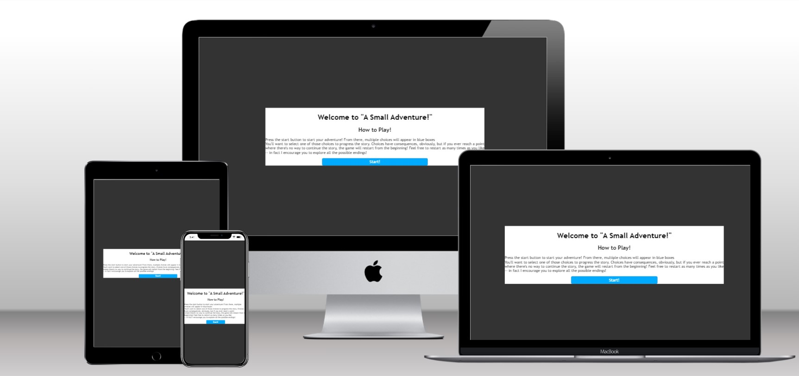
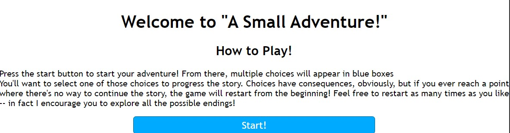
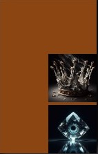
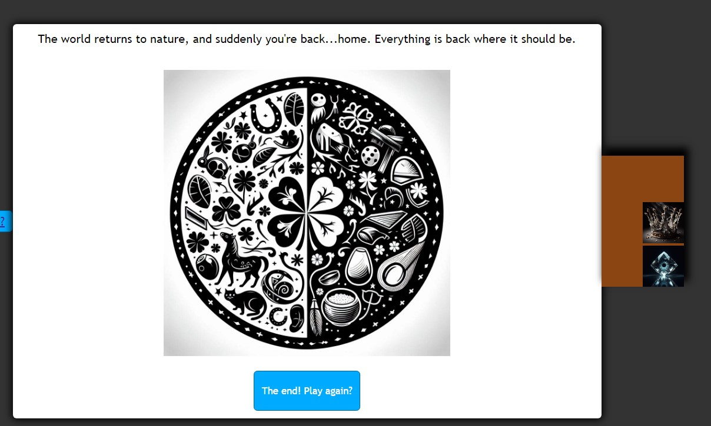
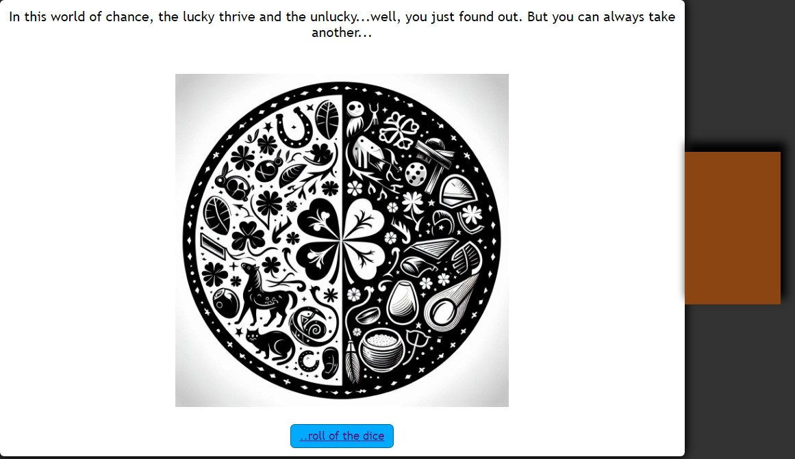
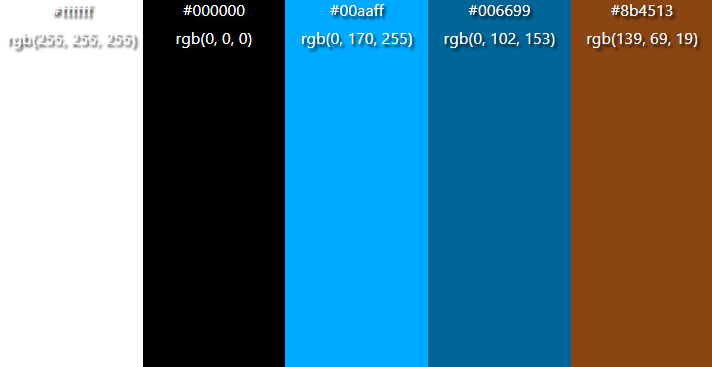

# ***A Small Adventure!***

## ***Introduction***
"A small adventure" is a choose-your-own adventure game based in a world where, instead of things being left to chance, fortune and misfortune are hard-divided. In its current iteration, the main goal of the story is to return this world to its natural state. There is also a secret ending where the player can instead rule the world as it is.



[Click here to view the deployed Page](https://acelliott1218.github.io/A-Small-Adventure/)

---

## ***Contents***

  - [***A Small Adventure!***](#a-small-adventure)
  - [***Introduction***](#introduction)
  - [***Contents***](#contents)
  - [***User Experience*** (UX)](#user-experience-ux)
    - [*Site Goals*](#site-goals)
    - [*Planned Features*](#planned-features)
  - [***User Experience Design (UXD)***](#user-experience-design-uxd)
      - [*Instructions on How to Play*](#guide)
      - [*Buttons Show only on Certain Prior Choices*](#choices-matter)
      - [*Inventory System*](#inventory)
      - [*Winner Screen*](#winning)
      - [*Death Screen*](#losing)
      - [*Secret Ending*](#secret-ending)
    - [*Colour Scheme*](#colour-scheme)
    - [*Design*](#design)
    - [*Image Sourcing*](#image-sourcing)
  - [***Features***](#features)
    - [*General Features*](#general-features)
    - [*Future Enhancements*](#future-enhancements)
  - [***Technologies Used***](#technologies-used)
    - [*Languages Used*](#languages-used)
    - [*Frameworks, Libraries \& Programs Used*](#frameworks-libraries--programs-used)
  - [***Testing***](#testing)
  - [***Deployment***](#deployment)
  - [***Credits***](#credits)
    - [*Content*](#content)
    - [*Media*](#media)

---

## ***User Experience*** (UX)

### *Site Goals*
- To be a replayable Choose Your Own Adventure Game for ages, roughly, 13+
- To be entertaining and puzzling
- To maintain a pattern of interaction as to not cause unpleasant user experiences
- To keep players in an exploration mindset
- To allow users to be the good guy or bad guy in the story
- To ensure the game is fully accessible on desktop and devices that are touch enabled
- To ensure the game is fully compliant with screen readers

### *Planned Features*
- Responsive Design - users should not have to force desktop mode, or switch to smaller devices, to play the game.
- Color contrast between main game area, inventory area, text, and options buttons to keep things easily readable
- Ability to return to the instructions page


## ***User Experience Design (UXD)***
### Guide

### Choices Matter
It is possible, and expected, that players will lose their game repeatedly -- further, it's completely possible that they will never see the secret ending. In fact, even the regular ending is hard to achieve. This is by design, and to increase replayability in a relatively small game.
### Inventory

### Winning

### Losing

### *Colour Scheme*
The color scheme was chosen based on utility, eg, ease of contrast between the various elements. 


### *Design*
The site was created to be relatively simple, with the base HTML acting as a skeleton and its content dictated by the Javascript functions. In retrospect, relying so heavily on this kind of dynamic HTML was biting off more than I could chew. Regardless, the focus of the site is on the story, rather than graphic elements (which are planned to be enhanced later).

### *Typography*
Basic fonts were chosen, largely for the small performance in runtime. 'Trebuchet MS', 'Lucida Sans Unicode', 'Lucida Grande', 'Lucida Sans', Arial, sans-serif.

### *Image Sourcing*
All images were created from Bing's AI generator.

---

## ***Features***
Website features are the many individual components that make up the site, making it easy to navigate, functional and valuable to visitors. 
### *General Features*
Favicon
The favicon, a small image resting off to the left of the page title, allows users (especially with a lot of tabs) to easily find the site.

Responsive HTML
Rather than having many different HTML presets, A Small Adventure depends on textNode support within the Javascript file its self. This also allows for ease of readability, rather than using excessive if-else statements. 

Inventory System
The game incorporates the inventory system, as some items lead to choices later on, and getting all items + the potion is required to get the secret ending.

### *Future Enhancements*
Changing the onclick use of the functions, such as inventoryAdd() or itemShow(), to something more dependable. Most of the development time was spent trying to find an alternative to this, and in the future it will be replaced.

Switching the textNode system to an if-else system. While the textNode system was chosen because of its easier readability, its overall fragility makes it excessively difficult to target its content without breaking the entire game. 

---

### *Acessibility*
Alt text has been added to the logo and various other images. Otherwise, the game depends mostly on reading, which is inherently screen-reader friendly.

---

## ***Technologies Used***

### *Languages Used*

HTML, CSS and Javascript were used to create this website.

## Deployment

### Version Control

The site was created using Codeanywhere at first and, later, Gitpod, and pushed to Git Hub to the remote repository ‘task-smasher’.

The following git commands were used throughout development to push code to the remote repo:

```git add .``` - This command was used to add all changes made during the development process

```git commit -m “commit message”``` - Used to commit the changes added through git add, along with commentary outlining what each commit did

```git push``` - Sent all committed changes to the remote repository on Github.com

### Deployment to Github Pages

- The site was deployed to GitHub pages. The steps to deploy are as follows: 
  - In the GitHub repository, navigate to the Settings tab 
  - From the menu on the left select 'Pages'
  - From the source section drop-down menu, select the Branch: main
  - Click 'Save'
  - A live link will be displayed in a green banner when published successfully. 

The live link can be found here - https://acelliott1218.github.io/A-Small-Adventure/

### Clone the Repository Code Locally

Navigate to the GitHub Repository you want to clone to use locally:

- Click on the code drop-down button
- Click on HTTPS
- Copy the repository link to the clipboard
- Open your IDE of choice (git must be installed for the next steps)
- Type git clone copied-git-URL into the IDE terminal

The project will now be cloned on your local machine for use.


### *Frameworks, Libraries & Programs Used*
- Github - To save and store the files for the site.
- Bing AI - to generate the images used in this project.
- favicon.io - To create the favicon for the site
- techsini.com - Used to create the mock up on multiple devices

---

## ***Testing***
Please [click](https://github.com/acelliott1218/A-Small-Adventure/blob/main/testing.md) to visit the testing page.

---


## ***Credits***

### *Content*
- https://www.color-hex.com/color-palette/15897 - colour scheme
- https://www.youtube.com/watch?v=R1S_NhKkvGA - project built from this basis
- https://github.com/TommySpecs/rock-paper-scissors-lizard-spock/tree/main -- basis for the README page


### *Media*
- https://www.bing.com/?toWww=1&redig=B9CB799792EF45A9AD75867943974B67 - media

## ***Development Issues***

The quality of this project is not up to my usual standards, this is due to various life events tearing away my focus and not even allowing me the time to set up mentoring sessions. If I had more time, I would have overhauled the way the game works to use something other than the textNode system.