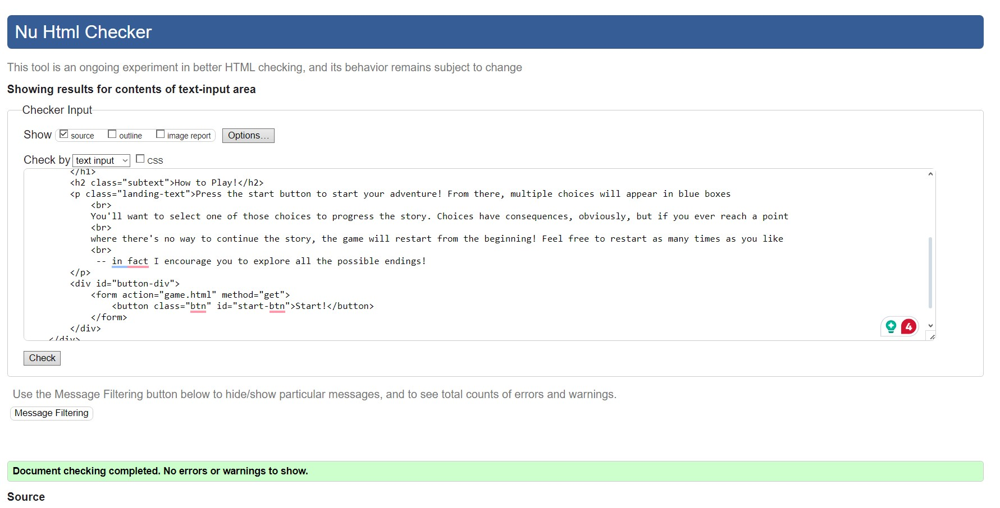
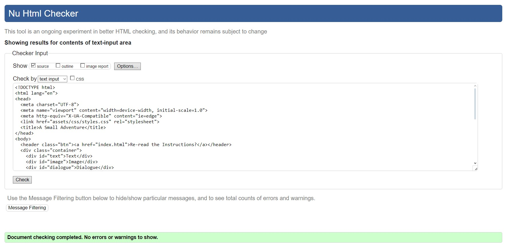
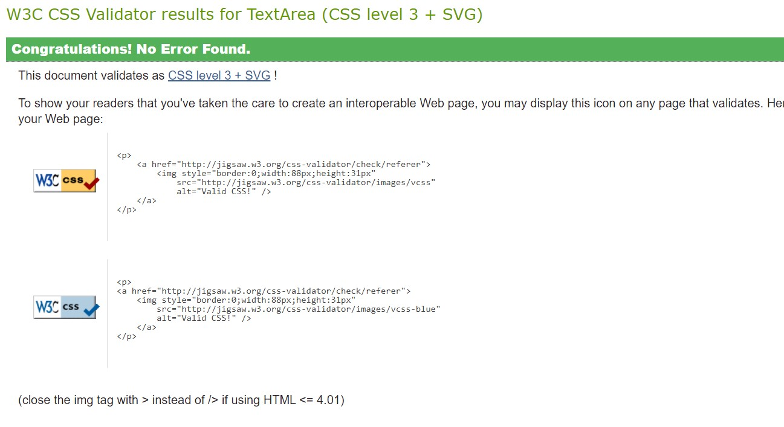
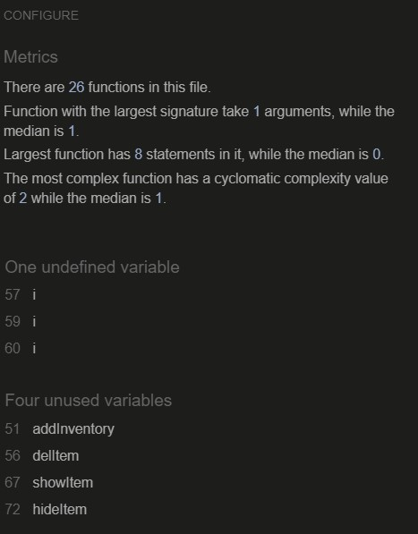

# Project 2 - ROCHAMBEAU! TESTING

## Contents
- [Automated Testing](#automated-testing)
    - [W3C Validator](#w3c-validator)
    - [W3C CSS Validator](#css)
    - [Javascript Validator](#jshint)
    - [Lighthouse](#lighthouse)
    - [Wave](#wave)
- [Manual Testing](#manual-testing)
    - [Devices Used](#devices-used)
    - [Browsers Used](#browsers-used)
        - [Desktop](#desktop-1920-x-1080)
        - [Laptop](#laptop-1366-x-768)
        - [Tablet](#tablet-apple-ipad-pro)
        - [Mobile](#mobile-apple-iphone-13-pro-max-128gb)
- [Bugs](#bugs)
    - [Fixed Bugs](#fixed-bugs)
    - [Known Bugs](#known-bugs)
---

## Automated Testing

### W3C Validator
####  *HTML*

W3C was used to validate the HTML of the ROCHAMBEAU! site. I  checked the HTML via direct input and also by copying the page source and running these through the validator.

*several info messages popped up these are caused by the formatting and are unable to be removed.

---

#### *CSS*
CSS Validation can only be done by copying and pasting the CSS file contents into the direct input.

---
## JSHint
### *Javascript*
JSHint is a program that flags suspicious usage in programs written in JavaScript. 

These variables are used, but the program had a hard time understanding that due to the structure of the textNodes.

---
## Manual testing

Some of the website functions needed to be tested manually, namely the game its self.

### *Devices Used*

| Device  | Name/ Size of Sevice| 
|---------|---------------|
| Desktop | 1920 x 1080 |
| Laptop  | 1366 x 768 |
| Tablet | Apple iPad Pro |
| Mobile | Apple iPhone 13 Pro Max 128GB |

### *Browsers Used*
Google Chrome

#### *Desktop (1920 x 1080)*
#### *Browser (Google Chrome)*
| feature                 | expected result                                                                                                                                                        | steps taken                                                                                                                                                                                                                                                                                                                                                                                                                                                                                                                                                                                                                                              | result                                                   | pass/fail |
|-------------------------|------------------------------------------------------------------------------------------------------------------------------------------------------------------------|----------------------------------------------------------------------------------------------------------------------------------------------------------------------------------------------------------------------------------------------------------------------------------------------------------------------------------------------------------------------------------------------------------------------------------------------------------------------------------------------------------------------------------------------------------------------------------------------------------------------------------------------------------|----------------------------------------------------------|-----------|
| instructions first page | first page contains instructions                                                                                                                                       | opened the game fresh                                                                                                                                                                                                                                                                                                                                                                                                                                                                                                                                                                                                                                    | expected                                                 | pass      |
| choices matter          | making certain choices, such as not picking up the coin, can  lock and unlock later choices.                                                                           | the following affects later game:  1. picking up and not picking up the coin --> can('t) pay to get into the castle or show you have charms to survive the forest  2. entering the forest --> gets the player killed or the rabbit's foot  3. the player needs to have drank the potion to fight the king  4. offering to help the chef makes the player a chef forever  5. getting all items + the potion enables the secret ending  6. the player can only kill the alchemist if the player already killed the guard, this is the only way to get the eye AND potion  7. the amulet can allow players into the castle and forest, rather than the coin | expected                                                 | pass      |
| inventory system        | when players get items, those items are added to an array called "inventory", and their image visibility is changed from hidden to visible.                            | got multiple items                                                                                                                                                                                                                                                                                                                                                                                                                                                                                                                                                                                                                                       | this works if the player isn't rushing through the page. | pass      |
| death screen            | a common death screen which sends players back to the instruction page                                                                                                 | died                                                                                                                                                                                                                                                                                                                                                                                                                                                                                                                                                                                                                                                     | expected                                                 | pass      |
| victory screen          | a screen for the non-hidden ending which sends players back to the instruction page                                                                                    | won the game normally                                                                                                                                                                                                                                                                                                                                                                                                                                                                                                                                                                                                                                    | expected                                                 | pass      |
| hidden ending           | the player becomes the new king, with total control over its inhabitants.                                                                                              | collected all items, fought the guard, fought the alchemist to get the eye and potion, fought the king                                                                                                                                                                                                                                                                                                                                                                                                                                                                                                                                                   | expected                                                 | pass      |
| new games are fresh     | when the player restarts the game, either through hitting the re-read instructions button,  winning, losing, or refreshing the page, their stats and items are cleared | restarted the game in all possible ways                                                                                                                                                                                                                                                                                                                                                                                                                                                                                                                                                                                                                  | expected                                                 | pass      |
| images                  | some scenes contain their own images, and in all other cases the logo is shown                                                                                         | played through the entire game, checking for images                                                                                                                                                                                                                                                                                                                                                                                                                                                                                                                                                                                                      | expected                                                 | pass      |
| responsiveness          | the game is playable on desktop, tablet, and mobile                                                                                                                    | played through the game on desktop, tablet, and mobile                                                                                                                                                                                                                                                                                                                                                                                                                                                                                                                                                                                                   | expected                                                 | pass      |

#### Laptop (1366 x 768)
#### Browser (Google Chrome)
| feature                 | expected result                                                                                                                                                        | steps taken                                                                                                                                                                                                                                                                                                                                                                                                                                                                                                                                                                                                                                              | result                                                   | pass/fail |
|-------------------------|------------------------------------------------------------------------------------------------------------------------------------------------------------------------|----------------------------------------------------------------------------------------------------------------------------------------------------------------------------------------------------------------------------------------------------------------------------------------------------------------------------------------------------------------------------------------------------------------------------------------------------------------------------------------------------------------------------------------------------------------------------------------------------------------------------------------------------------|----------------------------------------------------------|-----------|
| instructions first page | first page contains instructions                                                                                                                                       | opened the game fresh                                                                                                                                                                                                                                                                                                                                                                                                                                                                                                                                                                                                                                    | expected                                                 | pass      |
| choices matter          | making certain choices, such as not picking up the coin, can  lock and unlock later choices.                                                                           | the following affects later game:  1. picking up and not picking up the coin --> can('t) pay to get into the castle or show you have charms to survive the forest  2. entering the forest --> gets the player killed or the rabbit's foot  3. the player needs to have drank the potion to fight the king  4. offering to help the chef makes the player a chef forever  5. getting all items + the potion enables the secret ending  6. the player can only kill the alchemist if the player already killed the guard, this is the only way to get the eye AND potion  7. the amulet can allow players into the castle and forest, rather than the coin | expected                                                 | pass      |
| inventory system        | when players get items, those items are added to an array called "inventory", and their image visibility is changed from hidden to visible.                            | got multiple items                                                                                                                                                                                                                                                                                                                                                                                                                                                                                                                                                                                                                                       | this works if the player isn't rushing through the page. | pass      |
| death screen            | a common death screen which sends players back to the instruction page                                                                                                 | died                                                                                                                                                                                                                                                                                                                                                                                                                                                                                                                                                                                                                                                     | expected                                                 | pass      |
| victory screen          | a screen for the non-hidden ending which sends players back to the instruction page                                                                                    | won the game normally                                                                                                                                                                                                                                                                                                                                                                                                                                                                                                                                                                                                                                    | expected                                                 | pass      |
| hidden ending           | the player becomes the new king, with total control over its inhabitants.                                                                                              | collected all items, fought the guard, fought the alchemist to get the eye and potion, fought the king                                                                                                                                                                                                                                                                                                                                                                                                                                                                                                                                                   | expected                                                 | pass      |
| new games are fresh     | when the player restarts the game, either through hitting the re-read instructions button,  winning, losing, or refreshing the page, their stats and items are cleared | restarted the game in all possible ways                                                                                                                                                                                                                                                                                                                                                                                                                                                                                                                                                                                                                  | expected                                                 | pass      |
| images                  | some scenes contain their own images, and in all other cases the logo is shown                                                                                         | played through the entire game, checking for images                                                                                                                                                                                                                                                                                                                                                                                                                                                                                                                                                                                                      | expected                                                 | pass      |
| responsiveness          | the game is playable on desktop, tablet, and mobile                                                                                                                    | played through the game on desktop, tablet, and mobile                                                                                                                                                                                                                                                                                                                                                                                                                                                                                                                                                                                                   | expected                                                 | pass      |

#### Tablet (Apple iPad Pro)
#### Browser (Chrome)
| feature                 | expected result                                                                                                                                                        | steps taken                                                                                                                                                                                                                                                                                                                                                                                                                                                                                                                                                                                                                                              | result                                                   | pass/fail |
|-------------------------|------------------------------------------------------------------------------------------------------------------------------------------------------------------------|----------------------------------------------------------------------------------------------------------------------------------------------------------------------------------------------------------------------------------------------------------------------------------------------------------------------------------------------------------------------------------------------------------------------------------------------------------------------------------------------------------------------------------------------------------------------------------------------------------------------------------------------------------|----------------------------------------------------------|-----------|
| instructions first page | first page contains instructions                                                                                                                                       | opened the game fresh                                                                                                                                                                                                                                                                                                                                                                                                                                                                                                                                                                                                                                    | expected                                                 | pass      |
| choices matter          | making certain choices, such as not picking up the coin, can  lock and unlock later choices.                                                                           | the following affects later game:  1. picking up and not picking up the coin --> can('t) pay to get into the castle or show you have charms to survive the forest  2. entering the forest --> gets the player killed or the rabbit's foot  3. the player needs to have drank the potion to fight the king  4. offering to help the chef makes the player a chef forever  5. getting all items + the potion enables the secret ending  6. the player can only kill the alchemist if the player already killed the guard, this is the only way to get the eye AND potion  7. the amulet can allow players into the castle and forest, rather than the coin | expected                                                 | pass      |
| inventory system        | when players get items, those items are added to an array called "inventory", and their image visibility is changed from hidden to visible.                            | got multiple items                                                                                                                                                                                                                                                                                                                                                                                                                                                                                                                                                                                                                                       | this works if the player isn't rushing through the page. | pass      |
| death screen            | a common death screen which sends players back to the instruction page                                                                                                 | died                                                                                                                                                                                                                                                                                                                                                                                                                                                                                                                                                                                                                                                     | expected                                                 | pass      |
| victory screen          | a screen for the non-hidden ending which sends players back to the instruction page                                                                                    | won the game normally                                                                                                                                                                                                                                                                                                                                                                                                                                                                                                                                                                                                                                    | expected                                                 | pass      |
| hidden ending           | the player becomes the new king, with total control over its inhabitants.                                                                                              | collected all items, fought the guard, fought the alchemist to get the eye and potion, fought the king                                                                                                                                                                                                                                                                                                                                                                                                                                                                                                                                                   | expected                                                 | pass      |
| new games are fresh     | when the player restarts the game, either through hitting the re-read instructions button,  winning, losing, or refreshing the page, their stats and items are cleared | restarted the game in all possible ways                                                                                                                                                                                                                                                                                                                                                                                                                                                                                                                                                                                                                  | expected                                                 | pass      |
| images                  | some scenes contain their own images, and in all other cases the logo is shown                                                                                         | played through the entire game, checking for images                                                                                                                                                                                                                                                                                                                                                                                                                                                                                                                                                                                                      | expected                                                 | pass      |
| responsiveness          | the game is playable on desktop, tablet, and mobile                                                                                                                    | played through the game on desktop, tablet, and mobile                                                                                                                                                                                                                                                                                                                                                                                                                                                                                                                                                                                                   | expected                                                 | pass      |

#### Mobile (Apple iPhone 13 Pro Max 128GB)
#### Browser (Chrome) 
| feature                 | expected result                                                                                                                                                        | steps taken                                                                                                                                                                                                                                                                                                                                                                                                                                                                                                                                                                                                                                              | result                                                   | pass/fail |
|-------------------------|------------------------------------------------------------------------------------------------------------------------------------------------------------------------|----------------------------------------------------------------------------------------------------------------------------------------------------------------------------------------------------------------------------------------------------------------------------------------------------------------------------------------------------------------------------------------------------------------------------------------------------------------------------------------------------------------------------------------------------------------------------------------------------------------------------------------------------------|----------------------------------------------------------|-----------|
| instructions first page | first page contains instructions                                                                                                                                       | opened the game fresh                                                                                                                                                                                                                                                                                                                                                                                                                                                                                                                                                                                                                                    | expected                                                 | pass      |
| choices matter          | making certain choices, such as not picking up the coin, can  lock and unlock later choices.                                                                           | the following affects later game:  1. picking up and not picking up the coin --> can('t) pay to get into the castle or show you have charms to survive the forest  2. entering the forest --> gets the player killed or the rabbit's foot  3. the player needs to have drank the potion to fight the king  4. offering to help the chef makes the player a chef forever  5. getting all items + the potion enables the secret ending  6. the player can only kill the alchemist if the player already killed the guard, this is the only way to get the eye AND potion  7. the amulet can allow players into the castle and forest, rather than the coin | expected                                                 | pass      |
| inventory system        | when players get items, those items are added to an array called "inventory", and their image visibility is changed from hidden to visible.                            | got multiple items                                                                                                                                                                                                                                                                                                                                                                                                                                                                                                                                                                                                                                       | this works if the player isn't rushing through the page. | pass      |
| death screen            | a common death screen which sends players back to the instruction page                                                                                                 | died                                                                                                                                                                                                                                                                                                                                                                                                                                                                                                                                                                                                                                                     | expected                                                 | pass      |
| victory screen          | a screen for the non-hidden ending which sends players back to the instruction page                                                                                    | won the game normally                                                                                                                                                                                                                                                                                                                                                                                                                                                                                                                                                                                                                                    | expected                                                 | pass      |
| hidden ending           | the player becomes the new king, with total control over its inhabitants.                                                                                              | collected all items, fought the guard, fought the alchemist to get the eye and potion, fought the king                                                                                                                                                                                                                                                                                                                                                                                                                                                                                                                                                   | expected                                                 | pass      |
| new games are fresh     | when the player restarts the game, either through hitting the re-read instructions button,  winning, losing, or refreshing the page, their stats and items are cleared | restarted the game in all possible ways                                                                                                                                                                                                                                                                                                                                                                                                                                                                                                                                                                                                                  | expected                                                 | pass      |
| images                  | some scenes contain their own images, and in all other cases the logo is shown                                                                                         | played through the entire game, checking for images                                                                                                                                                                                                                                                                                                                                                                                                                                                                                                                                                                                                      | expected                                                 | pass      |
| responsiveness          | the game is playable on desktop, tablet, and mobile                                                                                                                    | played through the game on desktop, tablet, and mobile                                                                                                                                                                                                                                                                                                                                                                                                                                                                                                                                                                                                   | expected                                                 | pass      |

#### Fixed Bugs
Forgot to make sure the eye shows up in player's inventory after killing the alchemist, fixed this pretty simply
Fixed an issue where a forgotten quotation-mark was preventing the secret ending's text from being read

#### Known bugs
If the player clicks too fast through the options, the inventory system will not work. This is relatively small, since this game is based on reading, but if a player is zooming through the onclick events won't have time to catch up.